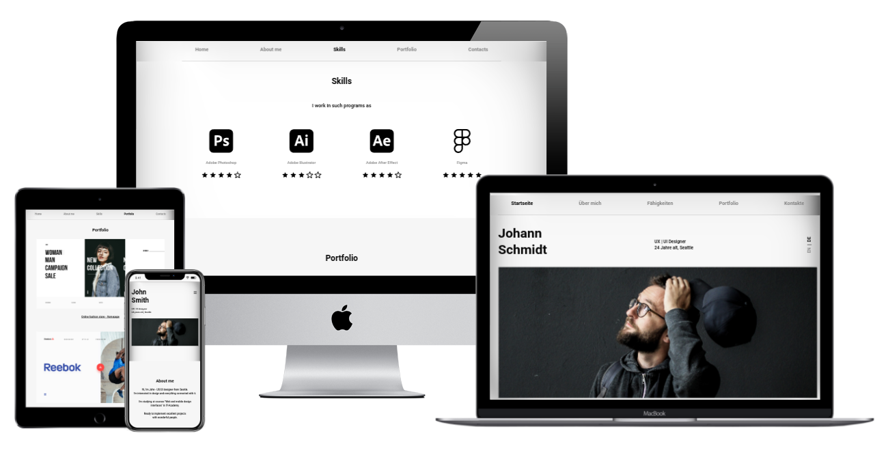

# Landing page Portfolio

Simple landing page portfolio website where you can introduce yourself, add your skills and works. It consists of 4 sections:

- Home
- About me
- Skills
- Portfolio
- Contacts

Website is responsive and adaptive to all devices and support multiple languages (English and German).

## Preview

    

## Tech Stack

- [CRA](https://create-react-app.dev/) - is an officially supported way to create single-page React applications. It offers a modern build setup with no configuration.
- [Typescript](https://www.typescriptlang.org/) - is a strongly typed programming language that builds on JavaScript, giving you better tooling at any scale.
- [Tailwindcss](https://tailwindcss.com/) - A utility-first CSS framework packed with classes that can be composed to build any design, directly in your markup.
- [React i18next](https://react.i18next.com/) - is a powerful internationalization framework for React / React Native which is based on i18next.